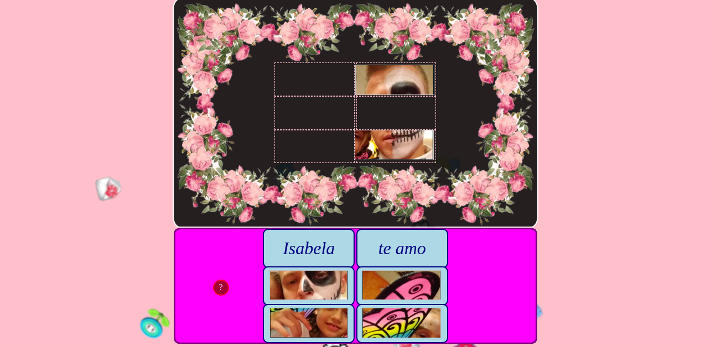

# Juego de Rompecabezas para Isabela

## A puzzle game for Isabela

### Tech:
- React
- JavaScript
- CSS

#### Project Start Date:
- 09-22-2019

#### Estimated Project Completion Date:
- 10-04-2019

#### MVP:
- Simple drag-and-drop game with draggable tiles
- No external libraries for D&D
- Tiles should respond to both mouse and touch
- User should be able to move tile anywhere on game area
- Game should have hint button offering peek at solution

#### Stretch Goals:
- Randomize tile generation 
- Make game responsive/mobile-friendly
- Make landing pad for each tile that responds to tile hovering and/or placed inside
- Have game check landing pad once finished, and check if winner or loser

#### Mega Stretch Goal:
- Add ability to upload other images for new games

#### More:
- react-sky
- react-cursor-position
- JSX
- Flexbox
- Exploratory coding--state management in pure React
- No special libraries for drag-and-drop; just me, myself, and mad props
- Straight slangin' props all over the place